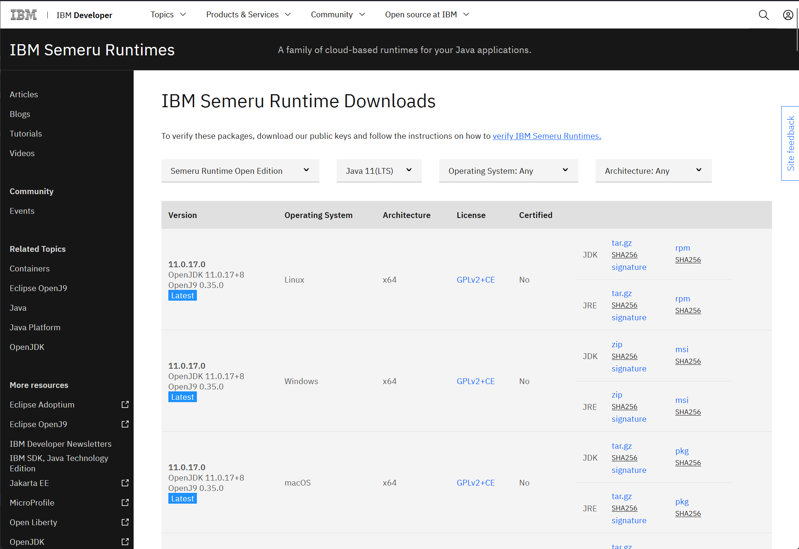
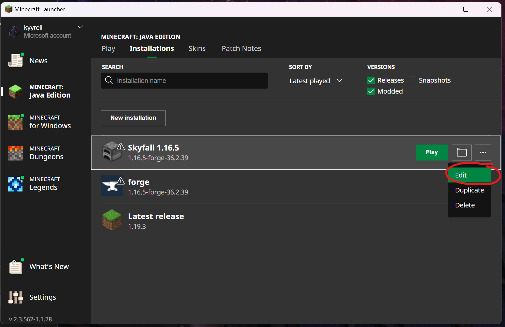
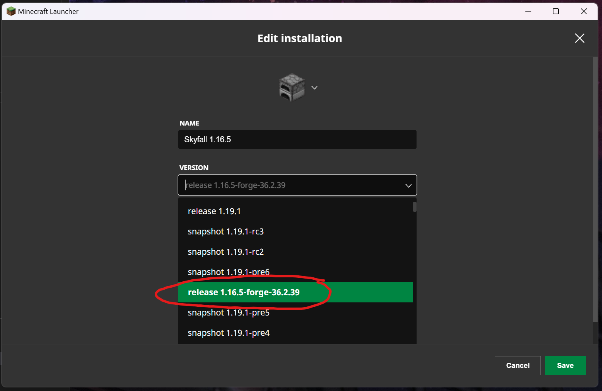
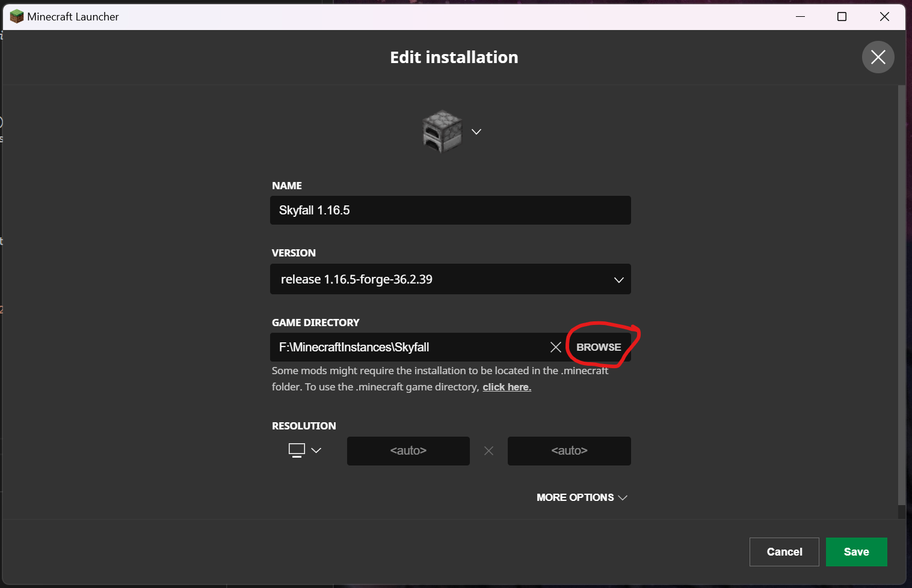

# Starfell Client Installation Guide
This guide will provide instructions for installing and setting up the Starfell modpack on your minecraft client.

## Prerequisites
Before proceeding with installation of the modpack on your local machine, you will first need the following components (if you already did this, continue on to the [Mod Pack Installation](./client-installation.md#modpack-installation) section):
```
Java JRE 11 LTS
Minecraft 1.16 (LATEST)
```

### _Java_
The java installation steps are virtually equivalent between all systems.

#### **Setting up Sumeru**
The recommended Java version to install is IBM Sumeru from IBM's developer website, but in theory any flavor of Java 11 should work with this modpack (though only Sumeru will be tested with this modpack and modded server). To install the IBM Sumeru Runtime, navigate to [this page](https://developer.ibm.com/languages/java/semeru-runtimes/), download the latest `Java 11.x.x.x LTS` version applicable to your OS and run the installer, following the default settings during the installation process. 


_Installation on the IBM Semeru website can be confusing at first, since there are so many variations of Java 11 from IBM for different operating systems. In the event of installation on windows, the link to download the installer is the blue "msi" text on the right-most column._

#### **Verifying the Installatrion**
Once Java is installed, open a command prompt or terminal (depending on your OS) and run the command: `java -version`. If it is installed correctly you should see the following response:
```log
PS C:\Users\<username>> java -version
openjdk version "11.0.17" 2022-10-18
IBM Semeru Runtime Open Edition 11.0.17.0 (build 11.0.17+8)
Eclipse OpenJ9 VM 11.0.17.0 (build openj9-0.35.0, JRE 11 Windows 11 amd64-64-Bit Compressed References 20221031_487 (JIT enabled, AOT enabled)
OpenJ9   - e04a7f6c1
OMR      - 85a21674f
JCL      - a94c231303 based on jdk-11.0.17+8)
```

### _Minecraft_
Installing an earlier version of minecraft is a pretty trivial process, which can be done entirely within the minecraft launcher. Installing the correct vanilla version of minecraft is important, as it ensures the necessary minecraft runtimes are downloaded for the base of the modpack. The steps to getting an older version of Minecraft installed can be seen below.

1. Startup the launcher and click on the "**installations**" tab on the top of the launcher window. This is in the same tab row as the play, sklins, and patch notes.


2. Once on the installations tab, click on the option to make a "**new installation**". This will bring you to a new page to select a new install (with an option to name the new installation).


3. On the new installation screen, set the name of the installation to "_Starfall 1.16_", and make sure to select the **VERSION** of the game to be "_release 1.16.5_".


4. One the name and version are entered, click on the down arrow that is labeled "**MORE OPTIONS**" (this is in the same area as the "**LESS OPTIONS**" as seen in the screenshot below). Adjust the value that is "_-Xnx2G_" to be "_-Xmx6G_". NOTE: If your computer has only 8GB of RAM, make this say "_-Xmx4G_" instead. If you can spare more memory, it is advised to use "_-Xmx8G" for systems with 16GB or more of system memory.


5. Once you have set all these, click on the "**Create**" option to save your new installation. On the next screen you should see your installation show up.


6. Click back to the "**Play**" tab and make sure your version next to the "PLAY" button is set to your new installation.


7. Once you've selected the new installation, click the play button to install the main Minecraft 1.16 files. When the game launches, close it and then proceed to install the modpack!

## Modpack Installation
Once the forge profile is successfully installed and configured, installation of the modpack is reletively simple, involving downloading the latest release `.tar.gz` file from the [releases page](https://github.com/stoicswe/starfell/releases) and un-archiving the contents of the tar file into a designated location for the Starfell mionecraft instance. The following steps will desribe the process.

### Prerequisits
_Note: In order to extract the modpack from the tar archive on Windows, you will need to installe the 7zip application, which can be found [here](https://www.7-zip.org/)._

### Steps for Installting the Modpack

1. Open the `.tar.gz` file (if on Windows, there will be a `.tar` file inside, open that as well in 7zip), and extract the contents of the client folder into a new folder titled "Starfell" and place that folder where you want the game to be installed to. This folder will serve as your game isntance folder.

2. If there was not a previously created installation titled: "_Starfall 1.16_", take the time to create one (see [this step for help](./client-installation.md#minecraft) for steps on this).

3. Navigate to the "**Installations**" tab in the minecraft launcher, and edit the "_Starfall 1.16_" installation.



4. On the installation editing page, change the version of the installation to `release 1.16.5-forge-36.2.39`. This version is what loads the modpack properly for gameplay.



5. Next, the installation needs to be pointed at the "_Starfall_" instance folder that was made earlier. Just click on the "**Browse**" button to navigate and select your "_Starfell_" folder.



6. Once that is all set, click on the save button to save changes. The installation is all setup and ready to go to play the modpack!